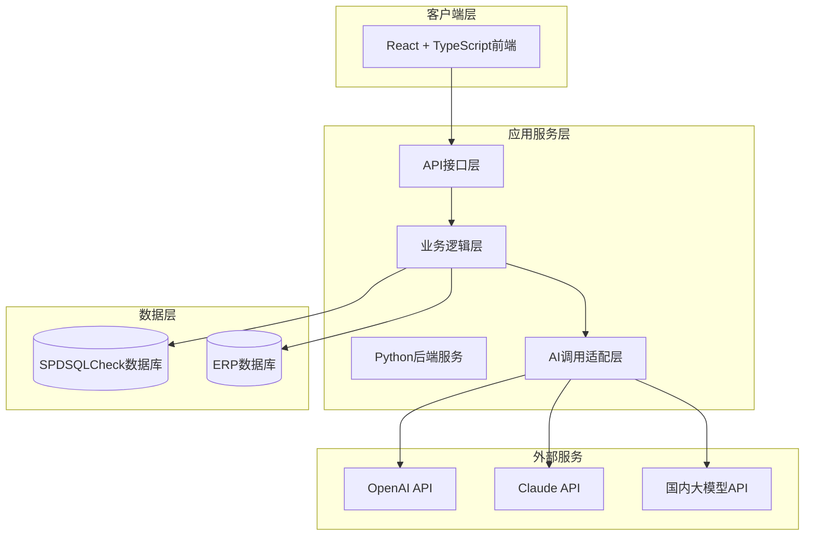
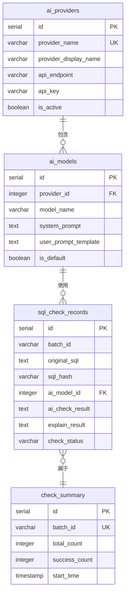
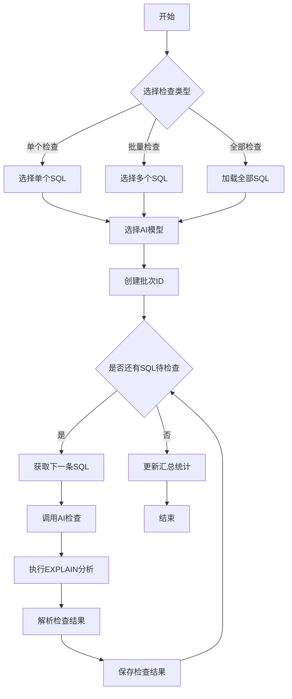
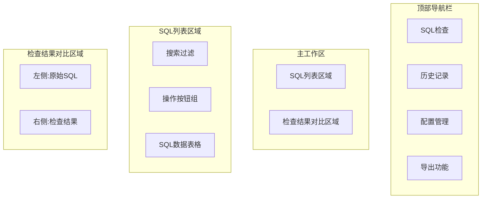
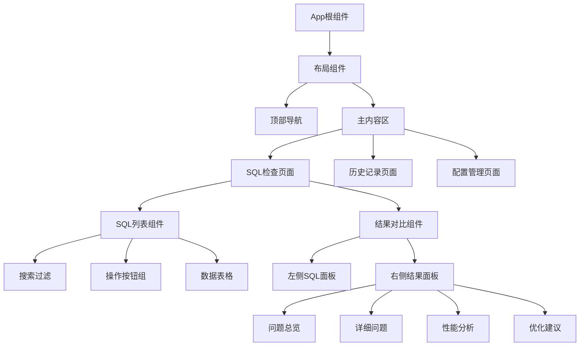
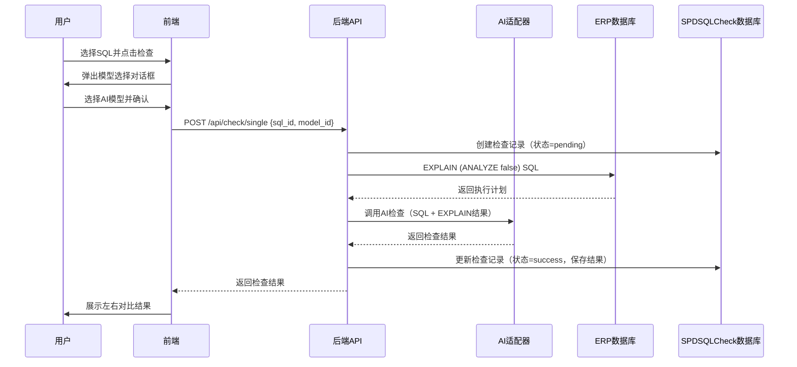
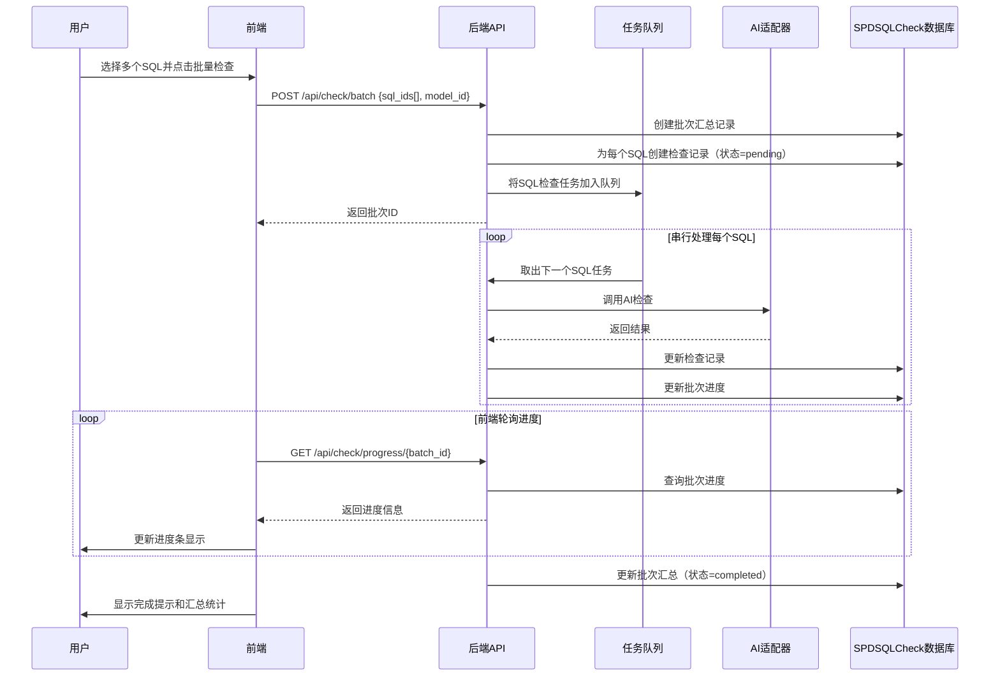
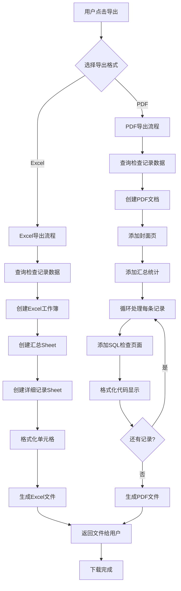

# SQL检查工具设计文档

## 一、项目概述

### 1.1 项目目标
为基于PostgreSQL的ERP系统开发一个SQL语句检查工具，通过AI技术自动检查SQL语法规范性和查询性能，帮助开发人员发现和优化潜在问题。

### 1.2 核心价值
- 自动化检查ERP系统中存储的SQL语句
- 结合PostgreSQL规范和实际表结构进行双重验证
- 支持多AI厂家灵活配置，适应不同使用场景
- 提供直观的对比展示和历史追溯能力

### 1.3 技术选型
- 后端：Python（最新稳定版本）
- 前端：React + TypeScript
- 数据库：PostgreSQL
- 部署方式：Web应用（浏览器访问）
- 架构模式：前后端分离

## 二、系统架构设计

### 2.1 整体架构



### 2.2 核心模块划分

| 模块名称 | 职责说明 | 主要功能 |
|---------|---------|---------|
| 前端展示模块 | 用户交互界面 | SQL列表展示、检查结果对比、配置管理、历史记录查询 |
| API接口模块 | 请求路由与响应 | RESTful API接口、请求验证、异常处理 |
| SQL检查引擎 | 核心检查逻辑 | 单个检查、批量检查、全部检查、结果汇总 |
| AI适配器模块 | AI服务调用 | 多厂家统一接口、提示词模板管理、响应解析 |
| 数据库连接模块 | 数据库操作 | ERP数据库连接、SPDSQLCheck数据库操作、SQL执行 |
| 配置管理模块 | 系统配置 | AI厂家配置、模型参数设置、数据库连接配置 |
| 结果存储模块 | 检查结果持久化 | 检查记录保存、历史查询、结果导出 |
| 性能分析模块 | EXPLAIN分析 | 执行计划获取、性能指标提取、优化建议生成 |

## 三、数据模型设计

### 3.1 SPDSQLCheck数据库表结构

#### 3.1.1 AI厂家配置表 (ai_providers)

| 字段名 | 数据类型 | 约束 | 说明 |
|-------|---------|------|------|
| id | SERIAL | PRIMARY KEY | 主键ID |
| provider_name | VARCHAR(50) | NOT NULL UNIQUE | 厂家名称（openai/claude/qwen/wenxin等） |
| provider_display_name | VARCHAR(100) | NOT NULL | 显示名称 |
| api_endpoint | VARCHAR(500) | NOT NULL | API端点地址 |
| api_key | VARCHAR(500) | NOT NULL | API密钥（需加密存储） |
| is_active | BOOLEAN | DEFAULT TRUE | 是否启用 |
| created_at | TIMESTAMP | DEFAULT CURRENT_TIMESTAMP | 创建时间 |
| updated_at | TIMESTAMP | DEFAULT CURRENT_TIMESTAMP | 更新时间 |

#### 3.1.2 AI模型配置表 (ai_models)

| 字段名 | 数据类型 | 约束 | 说明 |
|-------|---------|------|------|
| id | SERIAL | PRIMARY KEY | 主键ID |
| provider_id | INTEGER | FOREIGN KEY | 关联ai_providers表 |
| model_name | VARCHAR(100) | NOT NULL | 模型名称（如gpt-4/claude-3等） |
| model_display_name | VARCHAR(100) | NOT NULL | 显示名称 |
| system_prompt | TEXT | | 系统提示词 |
| user_prompt_template | TEXT | | 用户提示词模板 |
| max_tokens | INTEGER | DEFAULT 4000 | 最大令牌数 |
| temperature | DECIMAL(3,2) | DEFAULT 0.7 | 温度参数 |
| is_default | BOOLEAN | DEFAULT FALSE | 是否默认模型 |
| created_at | TIMESTAMP | DEFAULT CURRENT_TIMESTAMP | 创建时间 |
| updated_at | TIMESTAMP | DEFAULT CURRENT_TIMESTAMP | 更新时间 |

#### 3.1.3 ERP数据库配置表 (erp_database_config)

| 字段名 | 数据类型 | 约束 | 说明 |
|-------|---------|------|------|
| id | SERIAL | PRIMARY KEY | 主键ID |
| config_name | VARCHAR(100) | NOT NULL | 配置名称 |
| host | VARCHAR(200) | NOT NULL | 数据库主机 |
| port | INTEGER | NOT NULL DEFAULT 5432 | 端口号 |
| database_name | VARCHAR(100) | NOT NULL | 数据库名 |
| username | VARCHAR(100) | NOT NULL | 用户名 |
| password | VARCHAR(500) | NOT NULL | 密码（需加密存储） |
| sql_query_for_sqls | TEXT | NOT NULL | 获取SQL语句的查询语句 |
| is_active | BOOLEAN | DEFAULT TRUE | 是否启用 |
| created_at | TIMESTAMP | DEFAULT CURRENT_TIMESTAMP | 创建时间 |
| updated_at | TIMESTAMP | DEFAULT CURRENT_TIMESTAMP | 更新时间 |

#### 3.1.4 SQL检查记录表 (sql_check_records)

| 字段名 | 数据类型 | 约束 | 说明 |
|-------|---------|------|------|
| id | SERIAL | PRIMARY KEY | 主键ID |
| batch_id | VARCHAR(50) | | 批次ID（批量检查时相同） |
| original_sql | TEXT | NOT NULL | 原始SQL语句 |
| sql_hash | VARCHAR(64) | | SQL的哈希值（用于去重和索引） |
| check_type | VARCHAR(20) | NOT NULL | 检查类型（single/batch/all） |
| ai_model_id | INTEGER | FOREIGN KEY | 使用的AI模型ID |
| ai_check_result | TEXT | | AI检查结果 |
| explain_result | TEXT | | EXPLAIN执行计划结果 |
| performance_metrics | JSONB | | 性能指标（JSON格式存储） |
| check_status | VARCHAR(20) | NOT NULL | 检查状态（pending/success/failed） |
| error_message | TEXT | | 错误信息 |
| check_duration | INTEGER | | 检查耗时（毫秒） |
| created_at | TIMESTAMP | DEFAULT CURRENT_TIMESTAMP | 创建时间 |
| checked_at | TIMESTAMP | | 检查完成时间 |

#### 3.1.5 检查结果汇总表 (check_summary)

| 字段名 | 数据类型 | 约束 | 说明 |
|-------|---------|------|------|
| id | SERIAL | PRIMARY KEY | 主键ID |
| batch_id | VARCHAR(50) | UNIQUE | 批次ID |
| total_count | INTEGER | NOT NULL | 总SQL数量 |
| success_count | INTEGER | DEFAULT 0 | 成功数量 |
| failed_count | INTEGER | DEFAULT 0 | 失败数量 |
| warning_count | INTEGER | DEFAULT 0 | 警告数量 |
| start_time | TIMESTAMP | NOT NULL | 开始时间 |
| end_time | TIMESTAMP | | 结束时间 |
| total_duration | INTEGER | | 总耗时（秒） |
| created_by | VARCHAR(100) | | 创建人 |
| created_at | TIMESTAMP | DEFAULT CURRENT_TIMESTAMP | 创建时间 |

### 3.2 数据关系图



## 四、功能设计

### 4.1 SQL检查流程



### 4.2 AI检查逻辑

#### 4.2.1 检查维度

| 检查维度 | 检查内容 | 数据来源 |
|---------|---------|---------|
| 语法规范性 | PostgreSQL语法标准、SQL编写规范、命名规范 | AI分析 |
| 性能问题 | 索引使用、JOIN优化、子查询优化、LIMIT使用等 | AI分析 + EXPLAIN结果 |
| 安全问题 | SQL注入风险、权限使用、敏感数据访问 | AI分析 |
| 最佳实践 | 可读性、可维护性、扩展性建议 | AI分析 |

#### 4.2.2 提示词设计策略

**系统提示词结构**：
- 角色定位：PostgreSQL数据库专家和SQL优化顾问
- 检查标准：PostgreSQL官方规范、性能优化最佳实践
- 输出要求：结构化的检查结果，包含问题分类、严重程度、优化建议

**用户提示词模板变量**：
- {{SQL_STATEMENT}}：待检查的SQL语句
- {{EXPLAIN_RESULT}}：EXPLAIN执行计划结果
- {{TABLE_SCHEMA}}：相关表结构信息（可选）

#### 4.2.3 AI响应解析

期望AI返回的结构化信息：
- 总体评分：0-100分
- 问题列表：每个问题包含类型、严重程度、位置、描述、建议
- 优化后的SQL：改进版本的SQL语句（如适用）
- 性能评估：基于EXPLAIN的性能分析

### 4.3 EXPLAIN性能分析

#### 4.3.1 执行策略

在ERP数据库上执行EXPLAIN命令的方式：
- 使用EXPLAIN (ANALYZE false, VERBOSE, BUFFERS, FORMAT JSON)获取详细执行计划
- 不实际执行SQL（ANALYZE false），避免对生产数据的影响
- 仅对SELECT语句执行EXPLAIN，其他类型SQL仅做AI检查

#### 4.3.2 关键指标提取

| 指标名称 | 说明 | 判断标准 |
|---------|------|---------|
| 扫描类型 | Seq Scan/Index Scan/Bitmap Scan等 | 大表避免全表扫描 |
| 估算成本 | Total Cost值 | 与表大小相关的合理范围 |
| 估算行数 | Rows值 | 与实际数据量对比 |
| 缓冲区使用 | Shared/Temp Buffers | 评估内存占用 |
| JOIN方式 | Nested Loop/Hash Join/Merge Join | 根据数据量选择合适方式 |

### 4.4 用户界面设计

#### 4.4.1 主界面布局



#### 4.4.2 核心交互流程

**单个检查流程**：
1. 在SQL列表中选中一条SQL
2. 点击"检查"按钮
3. 弹出模型选择对话框
4. 确认后开始检查，显示进度指示
5. 检查完成后，在对比区域显示结果
6. 支持查看详细信息、复制、导出

**批量检查流程**：
1. 在SQL列表中勾选多条SQL（或使用过滤条件批量选择）
2. 点击"批量检查"按钮
3. 选择AI模型
4. 确认后进入批量检查模式
5. 显示整体进度条和当前检查的SQL
6. 串行逐个执行检查，实时更新进度
7. 完成后显示汇总统计和详细列表

**全部检查流程**：
1. 点击"全部检查"按钮
2. 系统弹出确认对话框，显示总SQL数量
3. 选择AI模型
4. 确认后从ERP数据库获取所有SQL
5. 创建批次，按序列号串行检查
6. 显示整体进度和预估剩余时间
7. 支持暂停和恢复功能

#### 4.4.3 检查结果展示设计

**左侧：原始SQL区域**
- 语法高亮显示
- 行号显示
- 支持代码折叠
- 可复制SQL文本

**右侧：检查结果区域**
分为多个标签页：

| 标签页 | 展示内容 |
|-------|---------|
| 问题总览 | 问题数量统计、严重程度分布、总体评分 |
| 详细问题 | 问题列表，每项包含：类型、严重程度、位置高亮、描述、建议 |
| 性能分析 | EXPLAIN执行计划可视化、关键性能指标、优化建议 |
| AI原始响应 | AI完整的检查报告原文 |
| 优化建议 | 改进后的SQL语句、对比高亮 |

### 4.5 配置管理功能

#### 4.5.1 AI厂家与模型配置

**配置界面结构**：
- AI厂家列表：展示已配置的厂家，支持新增、编辑、删除、启用/禁用
- 模型配置区域：选中厂家后，展示该厂家下的模型列表
- 模型详细配置：编辑系统提示词、用户提示词模板、参数设置

**配置验证**：
- 添加或修改AI厂家时，测试API连接可用性
- 配置模型时，支持提示词预览和测试
- 默认模型标记，系统自动使用默认模型进行检查

#### 4.5.2 ERP数据库配置

**配置项**：
- 数据库连接信息：主机、端口、数据库名、用户名、密码
- SQL获取查询：用于从ERP数据库获取待检查SQL的查询语句
- 连接测试：验证数据库连接和查询语句的有效性

**安全措施**：
- 密码和API密钥使用加密存储
- 连接信息不在前端明文传输
- 支持连接池配置，避免连接泄漏

### 4.6 历史记录功能

#### 4.6.1 查询条件

| 查询条件 | 说明 |
|---------|------|
| 时间范围 | 检查时间的起止日期 |
| 批次ID | 查询特定批次的所有记录 |
| 检查状态 | 成功/失败/警告 |
| AI模型 | 使用的AI模型 |
| SQL关键词 | 在SQL文本中搜索 |

#### 4.6.2 展示内容

- 检查记录列表：时间、SQL摘要、状态、使用模型、耗时
- 点击展开：查看完整的检查结果（复用检查结果对比界面）
- 批次汇总视图：批量检查的统计信息和明细列表

### 4.7 导出功能

#### 4.7.1 导出格式支持

**Excel格式**：
- 每行一条SQL检查记录
- 列包含：序号、原始SQL、检查状态、问题数量、严重问题、建议、检查时间
- 支持多sheet：汇总sheet + 详细记录sheet

**PDF格式**：
- 报告样式的导出
- 包含：封面、汇总统计、详细检查报告（每个SQL一页）
- 支持代码高亮和格式化展示

#### 4.7.2 导出范围

- 单个SQL的检查结果
- 选中的多个SQL检查结果
- 整个批次的检查结果
- 历史记录的筛选结果

## 五、技术实现策略

### 5.1 后端技术方案

#### 5.1.1 框架选择
- Web框架：FastAPI（异步支持、自动文档生成、高性能）
- ORM：SQLAlchemy（成熟稳定、支持PostgreSQL特性）
- 数据验证：Pydantic（类型安全、自动校验）
- 异步支持：asyncio + asyncpg（高效数据库连接）

#### 5.1.2 AI调用适配器设计

**统一接口抽象**：
定义抽象基类，所有AI厂家适配器继承该基类，实现统一的调用接口：
- 初始化方法：接收API配置
- 调用方法：发送提示词，返回标准化响应
- 异常处理：统一的错误处理和重试机制

**具体适配器实现**：
- OpenAI适配器：调用OpenAI API
- Claude适配器：调用Anthropic API
- 国内大模型适配器：分别实现通义千问、文心一言等的调用逻辑

**适配器工厂模式**：
根据配置的厂家名称，动态创建相应的适配器实例

#### 5.1.3 批量检查任务管理

**串行执行策略**：
- 使用任务队列逐个处理SQL检查请求
- 每个SQL检查完成后，立即保存结果
- 实时更新批次进度状态

**进度追踪**：
- 使用内存中的进度字典，存储批次ID对应的进度信息
- 提供WebSocket或轮询接口，前端实时获取进度
- 进度信息包含：总数、已完成数、当前处理的SQL、预估剩余时间

**异常处理**：
- 单个SQL检查失败不影响整体流程
- 记录失败原因到数据库
- 支持失败重试或跳过继续

#### 5.1.4 数据库操作

**连接管理**：
- 使用连接池管理SPDSQLCheck数据库连接
- ERP数据库连接单独管理，支持动态配置切换
- 连接超时和重连机制

**事务处理**：
- 批量检查时使用事务保证数据一致性
- 配置修改使用事务，失败自动回滚

**安全措施**：
- 使用参数化查询防止SQL注入
- 敏感信息加密存储（使用cryptography库）
- EXPLAIN执行时使用只读连接

### 5.2 前端技术方案

#### 5.2.1 技术栈
- 核心框架：React 18+
- 开发语言：TypeScript
- 状态管理：Zustand或Redux Toolkit
- UI组件库：Ant Design或Material-UI
- 代码编辑器：Monaco Editor（VSCode同款编辑器）
- HTTP客户端：Axios
- 构建工具：Vite

#### 5.2.2 组件结构设计



#### 5.2.3 状态管理策略

**全局状态**：
- AI模型配置列表
- ERP数据库配置
- 当前用户选择的默认模型
- 批量检查进度状态

**页面状态**：
- SQL列表数据和选中状态
- 当前查看的检查结果
- 搜索过滤条件

**本地状态**：
- 表单输入临时数据
- UI交互状态（展开/折叠、对话框显示等）

#### 5.2.4 实时进度更新方案

**方案选择**：优先使用轮询，简化部署复杂度

**轮询实现**：
- 批量检查开始后，前端每2秒请求进度接口
- 后端返回当前进度信息（已完成数、总数、当前SQL、预估时间）
- 前端更新进度条和状态显示
- 检查完成后停止轮询

**备选方案**：WebSocket（如需要更实时的体验）

### 5.3 部署方案

#### 5.3.1 独立部署架构

**部署组件**：
- Python后端服务：独立进程，监听指定端口（如8000）
- React前端：构建为静态文件，由后端服务托管或使用Nginx
- PostgreSQL数据库：本地安装，创建SPDSQLCheck数据库

**启动方式**：
- 后端：使用uvicorn启动FastAPI应用
- 前端：打包后的静态文件由后端static路由提供服务
- 一键启动脚本：自动检查依赖、初始化数据库、启动服务

#### 5.3.2 数据库初始化

**初始化流程**：
1. 检查SPDSQLCheck数据库是否存在，不存在则创建
2. 执行表结构创建脚本
3. 插入默认配置数据（本地PostgreSQL连接信息）
4. 创建必要的索引

**数据库迁移**：
使用Alembic进行版本管理，支持数据库schema升级

#### 5.3.3 配置文件

**配置项**：
- 数据库连接：SPDSQLCheck数据库的连接信息（默认postgres/123456）
- 服务端口：后端服务监听端口
- 日志配置：日志级别和输出路径
- CORS配置：允许的前端域名

**配置方式**：
- 使用配置文件（YAML或JSON格式）
- 支持环境变量覆盖
- 敏感信息支持从环境变量读取

## 六、关键流程详细设计

### 6.1 单个SQL检查流程



### 6.2 批量检查流程



### 6.3 AI调用流程

```mermaid
flowchart TD
    Start[开始AI检查] --> GetConfig[获取AI模型配置]
    GetConfig --> BuildPrompt[构建提示词]
    
    BuildPrompt --> SystemPrompt[加载系统提示词]
    BuildPrompt --> UserPrompt[生成用户提示词]
    
    UserPrompt --> ReplaceVars[替换模板变量]
    ReplaceVars --> |{{SQL_STATEMENT}}| InsertSQL[插入SQL语句]
    ReplaceVars --> |{{EXPLAIN_RESULT}}| InsertExplain[插入EXPLAIN结果]
    
    InsertSQL --> SelectAdapter[选择AI适配器]
    InsertExplain --> SelectAdapter
    
    SelectAdapter --> CallAPI[调用AI API]
    CallAPI --> CheckResponse{响应是否成功}
    
    CheckResponse -->|是| ParseResponse[解析响应内容]
    CheckResponse -->|否| Retry{是否需要重试}
    
    Retry -->|是| CallAPI
    Retry -->|否| ReturnError[返回错误信息]
    
    ParseResponse --> ExtractResult[提取结构化结果]
    ExtractResult --> End[返回检查结果]
    ReturnError --> End
```

### 6.4 导出流程



## 七、安全与性能考虑

### 7.1 安全措施

| 安全方面 | 措施 |
|---------|------|
| 数据加密 | API密钥和数据库密码使用AES加密存储 |
| SQL注入防护 | 所有数据库操作使用参数化查询 |
| API认证 | 后端API添加认证机制（可选：JWT Token） |
| EXPLAIN安全 | 使用ANALYZE false避免实际执行SQL，使用只读账户连接 |
| 敏感信息脱敏 | 日志中不记录完整API密钥和密码 |
| CORS配置 | 限制允许访问的前端域名 |

### 7.2 性能优化

| 优化方面 | 策略 |
|---------|------|
| 数据库查询 | 为sql_hash、batch_id、check_status创建索引 |
| AI调用 | 实现请求缓存，相同SQL避免重复调用AI |
| 批量检查 | 串行执行避免API限流，显示进度避免用户焦虑 |
| 结果展示 | 前端使用虚拟滚动处理大量SQL列表 |
| 导出优化 | 大量数据导出时使用流式处理，避免内存溢出 |
| 连接池 | 数据库连接使用连接池，避免频繁创建销毁 |

### 7.3 异常处理

**AI调用异常**：
- API调用失败：记录错误信息，标记为失败状态
- 超时处理：设置合理超时时间（如60秒），超时后重试
- 配额限制：捕获配额不足异常，提示用户

**数据库异常**：
- 连接失败：提示用户检查数据库配置
- 查询超时：对复杂EXPLAIN设置超时，超时后跳过性能分析
- 事务回滚：关键操作使用事务，失败自动回滚

**前端异常**：
- 网络请求失败：显示友好错误提示，支持重试
- 数据格式异常：前端校验数据结构，异常时显示错误信息

## 八、扩展性设计

### 8.1 可扩展点

| 扩展点 | 说明 |
|-------|------|
| AI厂家支持 | 通过实现统一适配器接口，轻松添加新的AI厂家 |
| 检查维度 | 可扩展新的检查维度（如代码规范、业务规则等） |
| 导出格式 | 可添加新的导出格式（如Word、Markdown等） |
| 数据库类型 | 预留接口支持MySQL、Oracle等其他数据库 |
| 通知方式 | 批量检查完成后支持邮件、webhook等通知 |

### 8.2 未来增强方向

- 支持多用户和权限管理
- 提供检查规则自定义配置
- 集成CI/CD流程，自动检查新增或修改的SQL
- 提供API接口，供其他系统集成调用
- 支持SQL优化建议的自动应用和验证
- 增加统计分析功能，展示SQL质量趋势
